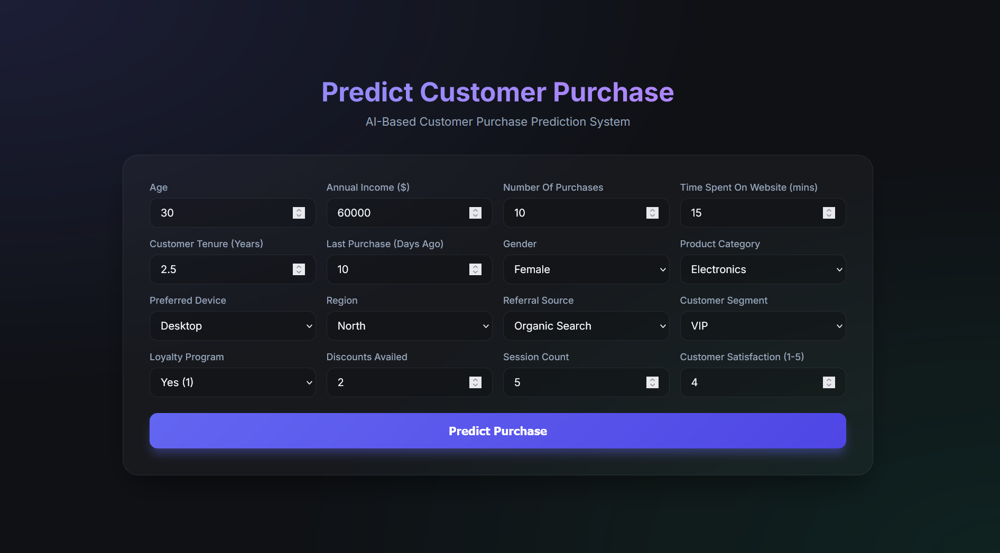
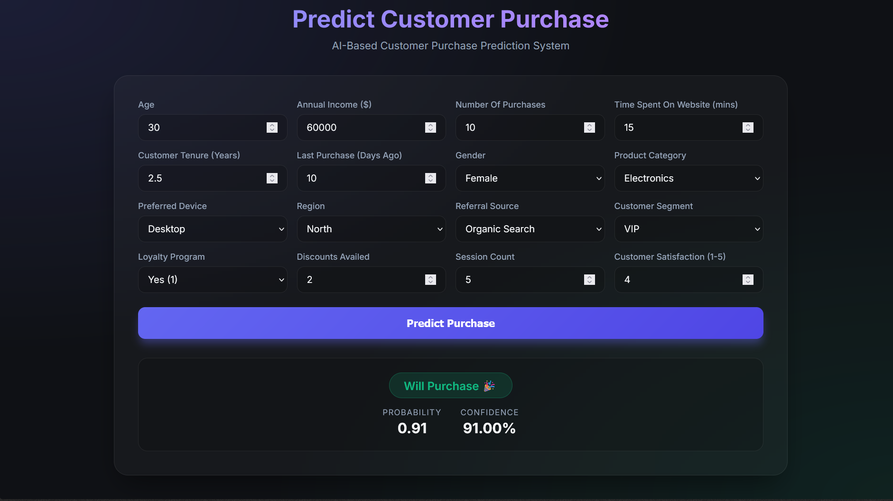

#  AI-Based Customer Purchase Prediction System


A full-stack machine learning application designed to predict whether a customer will make a purchase based on demographic, behavioral, and historical data. The project utilizes a robust **RandomForest** machine learning pipeline hosted on a high-performance **FastAPI** backend, connected to a modern, responsive **React + Vite** frontend.

---

##  Project Architecture

The system is split into three primary components:

1. **Machine Learning Pipeline (`train_pipeline.py`)**: 
   - Uses `scikit-learn` to preprocess a 500k row dataset (`customerData_500k.csv`).
   - Implements a `ColumnTransformer` (One-Hot Encoding for categoricals, Standard Scaling for numericals).
   - Trains a `RandomForestClassifier` and exports the fully embedded pipeline as `model.pkl`.

2. **Backend API (`main.py`)**:
   - Built with **FastAPI** for maximum performance.
   - Utilizes **Pydantic** for strict request payload validation.
   - Serves predictions instantly by loading the pre-trained `model.pkl`.

3. **Frontend Application (`frontend/`)**:
   - Built with **React** and bundled via **Vite**.
   - Features a custom, glassmorphic UI using pure Vanilla CSS.
   - Fully responsive grid layouts dynamically interacting with the backend.

---

##  Screenshots

### Dashboard Overview


### Prediction Results


---

##  Folder Structure

```text
Customer Purchase Prediction/
│
├── Dataset/
│   └── customerData_500k.csv      # Source dataset (500,000 records)
│
├── frontend/                      # React + Vite Frontend App
│   ├── src/
│   │   ├── App.jsx                # Main React UI and Logic
│   │   ├── App.css                # Component styling (Glassmorphism)
│   │   ├── index.css              # Global styles and CSS variables
│   │   └── main.jsx               # React entry point
│   ├── package.json               # Node.js dependencies
│   └── vite.config.js             # Vite configuration
│
├── main.py                        # FastAPI Backend Server
├── train_pipeline.py              # ML Data Processing & Training Script
├── requirements.txt               # Python Dependencies
├── model.pkl                      # Compiled ML Model (Generated)
└── README.md                      # Project Documentation
```

---

##  Requirements

Before beginning, ensure you have the following installed on your system:
- **Python** (v3.9 or higher)
- **Node.js** (v18 or higher) & **npm**

---

##  Installation Guide

### 1. Clone the Repository
```bash
git clone https://github.com/your-username/customer-purchase-prediction.git
cd "customer-purchase-prediction"
```

### 2. Backend Setup & Model Training
Open a terminal in the root directory:
```bash
# Create and activate a virtual environment
python -m venv venv

# Windows:
.\venv\Scripts\activate
# Mac/Linux:
source venv/bin/activate

# Install dependencies
pip install -r requirements.txt
```

> ** Important Data Requirement**
> The dataset is excluded from version control due to its size. Before training the model:
> 1. Download the dataset from [Google Drive](https://drive.google.com/file/d/1wEVXQgnPnJgFhW0mH2clhOZEj5m_e16Z/view?usp=drive_link).
> 2. Create a folder named `Dataset` in the root directory.
> 3. Place the downloaded file inside the `Dataset` folder and ensure it is exactly named `customerData_500k.csv`.

```bash
# Train the machine learning model (Generates model.pkl)
python train_pipeline.py

# Start the FastAPI server
python main.py
# (Server runs at http://127.0.0.1:8000)
```

### 3. Frontend Setup
Open a **new** terminal in the root directory:
```bash
# Navigate to the frontend directory
cd frontend

# Install Node dependencies
npm install

# Start the Vite development server
npm run dev
# (App runs at http://localhost:5173)
```

---

##  API Documentation

The backend exposes an interactive Swagger UI available at `http://127.0.0.1:8000/docs`. 

### `GET /`
**Description**: Health check endpoint.
**Response**:
```json
{
  "status": "running"
}
```

### `POST /predict`
**Description**: Accepts customer data and returns a purchase prediction.
**Request Body (JSON)**:
```json
{
  "Age": 30,
  "AnnualIncome": 60000,
  "NumberOfPurchases": 10,
  "TimeSpentOnWebsite": 15.0,
  "CustomerTenureYears": 2.5,
  "LastPurchaseDaysAgo": 10,
  "Gender": "Female",
  "ProductCategory": "Electronics",
  "PreferredDevice": "Desktop",
  "Region": "North",
  "ReferralSource": "Organic",
  "CustomerSegment": "VIP",
  "LoyaltyProgram": 1,
  "DiscountsAvailed": 2,
  "SessionCount": 5,
  "CustomerSatisfaction": 4
}
```

**Response (JSON)**:
```json
{
  "Prediction": 1,
  "Probability": 0.88,
  "Confidence": "88.00%"
}
```
*(Prediction `1` = Purchase, `0` = No Purchase)*

---

## 🔮 Future Improvements

- **Database Integration**: Implement PostgreSQL or MongoDB to persist historical user predictions and track model drift over time.
- **Advanced Model Deployment**: Experiment with Gradient Boosting frameworks like `LightGBM` or `XGBoost` to further optimize accuracy.
- **Authentication**: Add JWT-based authentication for securing the API and frontend dashboard.
- **Dockerization**: Wrap both the frontend and backend into a single `docker-compose.yml` file for immediate deployment to cloud providers like AWS or Render.
- **Frontend Upgrades**: Expand the UI into a multi-page dashboard featuring predictive analytics charts using `Chart.js`.
